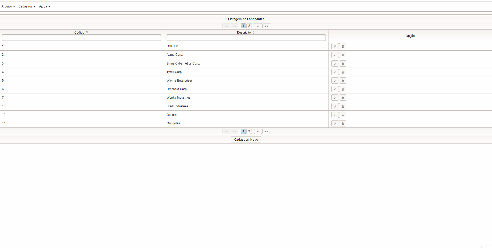

<h1 align="center">
 Drogaria
</h1>

<h4 align="center"> Projeto construído utilizando o framework JSF e Primefaces, onde é possível cadastrar, editar e remover Fabricante/Produto diretamente de um banco de dados na nuvem (Heroku).</h4>

  Link do Deploy: 
  <a href="https://drogaria-nevitoniuri.herokuapp.com/" >https://drogaria-nevitoniuri.herokuapp.com/</a>

